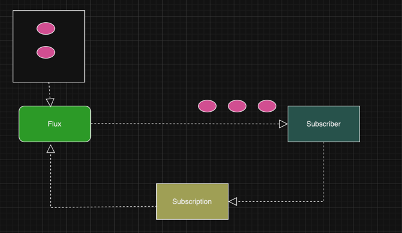

# Flux

1. Flux can emit 0, 1 ... N Items.
2. Followed by an onComplete / onError Signals
3. It can be never ending signals without signalling the onComplete or onError

## Flux (Not Exhaustive)

1. Just
2. fromIterable
3. fromArray
4. fromStream