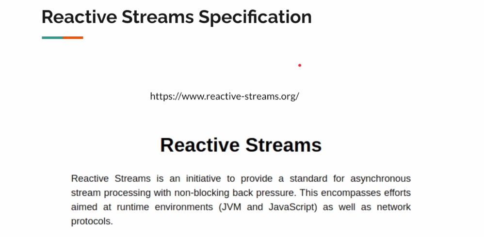

# Reactive Programming

## Features

- Inbound and Outbound


1. Sync + Blocking: When you call the insurance company the automated caller will make you wait until the agent comes online until then you will be waiting for the agent. This is called sync + blocking communication
2. Async: Instead of I am calling the insurance company I requested my friend or family member to call the insurance company on my behalf. In this case I am not blocked by the person whom I delegated the work they are blocked.
3. Non Blocking: I have called the insurance company now the automated teller will ask for the call back phone number so that we are not blocked on a call. Once we hang up the call we will get the call from the agent later in the future.
4. Non Blocking + Async : I will call the insurance company they will ask the phone number. Now instead of giving my number I will give my friends or family members number so that I am not blocked at any point of time.

All in all the reactive programming is to simplify the nonblocking async operations.


## Do I really need reactive programming? Why can't I use the virtual threads?

1. Request Response Model: If it is a simple request response model then using the virtual threads is a great idea to move forward.
   
2. But Reactive programming will open the doors for the additional communication patterns.
   

# What is a streaming response?
For a request you will receive multiple responses.

For Example: Lets say you ordered a pizza using an order app. Now you will get an ack that your order has been placed.
Now the restaurant will be sending the stream of responses to your order app that 
1. Your Pizza is in oven for backing.
2. Your Pizza is packaged and ready for delivery waiting for the delivery boy.
3. Delivery boy has your pizza and 10 miles away
4. After 5 mins your pizza is 1 mile away
5. In the last your pizza delivered at your door step.

# What is streaming request?

Let's consider that you are editing the google doc on a remote server. As you keep typing you are making a stream of request to update the doc.
In other words you will open a single connection through which we will send the multiple stream of messages.

# What is the bidirectional streaming?

This is like your what's app chat, Teams messenger where 2 people or 2 entities will be talking to each other through a communication channel.

All in all, All these communication patterns are possible in reactive programming.

## What is reactive programming / reactive streams specifications? 


All the tech gaints companies has realized that the applications are getting more complex. where they want the update or notifications more in real time to all platforms.

Every platform cannot do typical request and response model to get the latest update from the remote server instead the server has to notify to the clients when ever there is an update.

## Examples

1. What kind of movies the user is browsing
2. what kind of tweets now the server will monitor the stream of requests, because there are stream of requests and stream of responses happen back and forth in this case the traditional request and response model will not help.

3. [Reactive Streams org](https://www.reactive-streams.org/)


# Concepts of Reactive Programming.

A programming paradigm designed to process stream of messages in a non blocking and async manner, while handling back pressure.

It is based on observer design pattern.

1. Async and Stream Processing
2. Non Blocking Back Pressure


# Publisher / Subscriber Pattern

1. The **Publisher** needs an instance of the **Subscriber** to work. It will pass the **Subscriber** instance to the **Subscription**.
2. The **Subscription** holds information about the **Subscriber**.
3. The **Publisher**, using the **Subscription** instance, invokes `onSubscribe()` to inform the **Subscriber** about the subscription.
4. In simpler terms, the **Publisher** hands over the **Subscriber's** details to the **Subscription** and notifies the **Subscriber** through the **Subscription** instance.

## PublisherImpl.java:

```
public class PublisherImpl implements Publisher<String> {
    @Override
    public void subscribe(Subscriber<? super String> subscriber) {
        SubscriptionImpl subscription = new SubscriptionImpl(subscriber);
        subscriber.onSubscribe(subscription);
    }
}

```

## SubscriberImpl.java:

```
public class SubscriberImpl implements Subscriber<String> {
    private Subscription subscription;

    public Subscription getSubscription() {
        return subscription;
    }

    @Override
    public void onSubscribe(Subscription subscription) {
        this.subscription = subscription;
    }

    @Override
    public void onNext(String randomString) {
        log.info("Received: {}", randomString);
    }

    @Override
    public void onError(Throwable t) {
        log.error("Error encountered", t);
    }

    @Override
    public void onComplete() {
        log.info("Completed");
    }
}

```

## SubscriptionImpl.java:

```
public class SubscriptionImpl implements Subscription {
    private Subscriber<? super String> subscriber;

    public SubscriptionImpl(Subscriber<? super String> subscriber) {
        this.subscriber = subscriber;
    }

    @Override
    public void request(long n) {
        subscriber.onNext("Hello World");
    }

    @Override
    public void cancel() {
        log.info("Subscription cancelled");
    }
}

```

## ReactiveCodingApplication
```
public class ReactiveCodingApplication {

    public static void main(String[] args) {
        execute();
    }

    public static void execute() {
        PublisherImpl publisher = new PublisherImpl();
        SubscriberImpl subscriber = new SubscriberImpl();
        publisher.subscribe(subscriber);

        subscriber.getSubscription().request(3); // Request 3 items of data
    }
}

```

- Feature 2
- Feature 3

